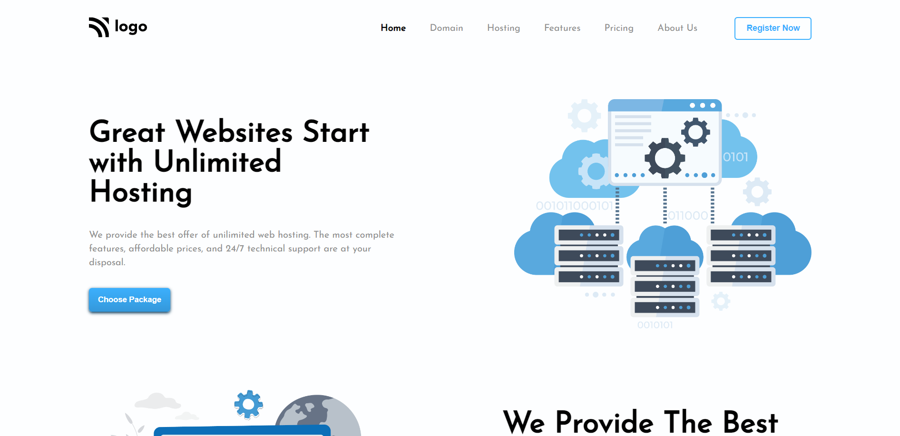

# Project 11 - HTML and CSS

By Piyush Bhatt

Deployed link of website &nbsp; 

 

# [Link to Project 11](https://hosting-landingpage-five.vercel.app/)

 

# Preview of the Project.

 

## What I learnt in this Project?

- I learned about how to make website **layout** through **flexbox.**
- I also learnt about how to make **cards** using flex properties.
- I also learnt how to create **subscription box design** using css.
- I also learnt how to make **reviews section** of website.
- I also learnt to make **beautiful footer**.

  

# Time Taken to complete  this project is 8 hour.